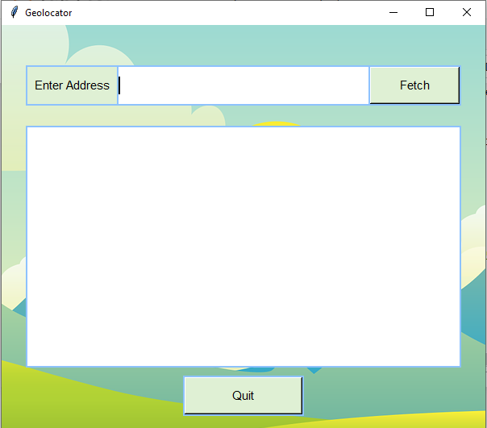
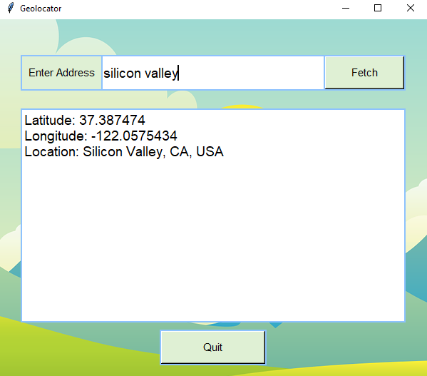
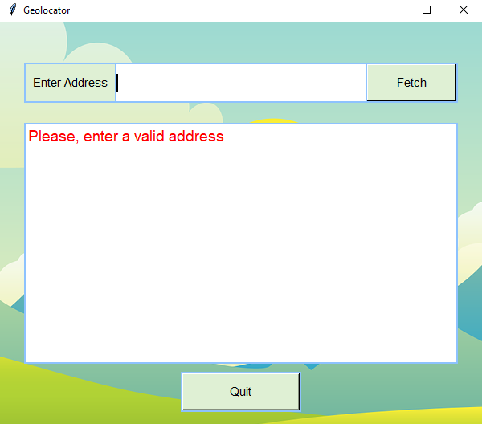

# Geolocator
This **geolocator** uses the popular python GUI (Graphical User Interface) library, **Tkinter**. It takes in address and returns its longitude and latitude.  

On running the code cell, the interface looks like this:  

  

After inputting an address, the result displays like this:  

  

When trying to get the physical location of an empty address:  

  

When trying to get the physical location without connecting to the internet:  

